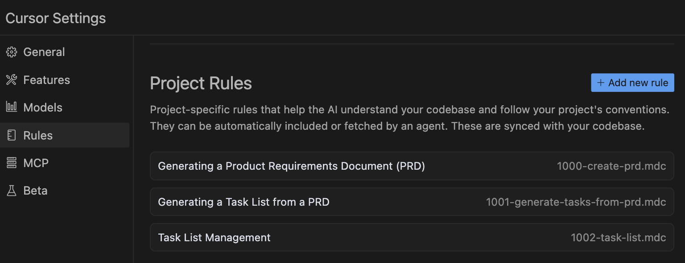

# Cursor AI Rules for Task management

Cursor AI is an awesome product to help Developers in the daily work.

Using the Tab model is possible to organize a Prompt in multiple tasks and execute them in a secuential way.

This set of tasks provide the following solution:

- Create PRD file
- Create a List of Tasks based on a PRD file
- Execute taskss

## References

- https://www.task-master.dev/
- https://github.com/snarktank/ai-dev-tasks
- https://x.com/ryancarson/status/1913624687894004193
- https://github.com/elie222/inbox-zero/blob/main/.cursor/rules/task-list.mdc